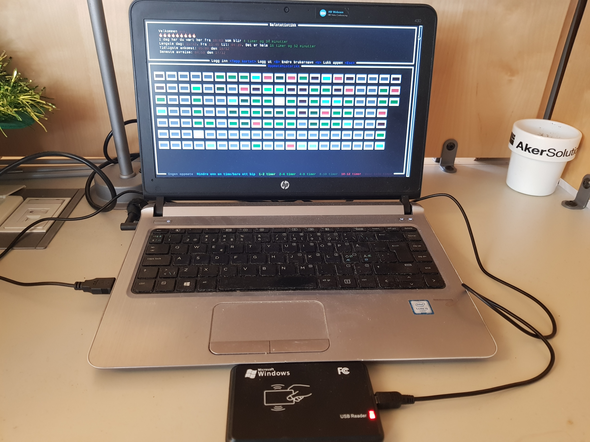

# Salstatistikk

Enkelt innsjekkingssystem for lesesal ved bruk av kortleser. Viser hver bruker hvor lang "streak" de har, hva deres lengste dag er, o.l.

Brukes sammen med en enkel USB-tilkoblet kortleser som sender en streng med karakterer og deretter ENTER når man biper et kort på den.

Repoet inneholder både en prototyp skrevet i Python, og et mer avansert brukergrensesnitt skrevet i Rust. De to interagerer ikke med hverandre.

## Migrere fra logfiler til sql

Kjør `cargo run --release -- migrate`. Merk mellomrommet før migrate.

For å dumpe tilbake til loggfiler kan du kjøre `cargo run --release -- dump`. Merk at statistikk ikke overføres, så det må kjøres på nytt.
